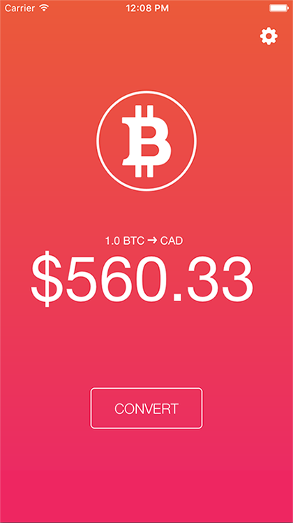
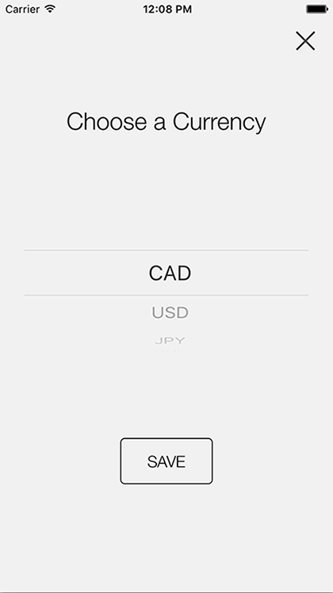

# Bit
Created to test the waters of all aspects of iOS development, Bit is a bitcoin app that converts the current exchange rate to various other currencies.

## Screenshots



## Dev
This project uses some cocoapod dependencies. Make sure to install them before trying to build.
```
pod install
```

## Credits
Bitcoin icon by [Isaac Grant](https://dribbble.com/isc)
